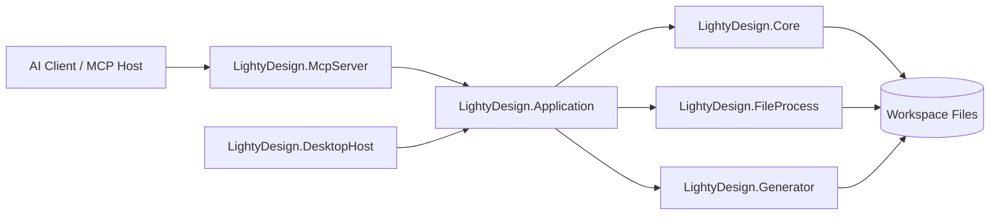

# MCP 子系统

## 职责

MCP 子系统用于把 LightyDesign 现有的工作区读取、表结构理解、类型校验、工作簿写回和代码导出能力，包装为适合 AI 调用的 Model Context Protocol 接口，使 AI 能在“理解策划表结构”和“协助编写策划表内容”两个方向上稳定工作。

它的目标不是让 AI 直接读写 `.txt` 或 `_header.json` 文件，而是让 AI 通过受控工具调用现有领域模型和宿主编排能力完成工作。

## 设计目标

1. 让 AI 能读取工作区、工作簿、Sheet、列定义和局部数据内容。
2. 让 AI 能在不破坏现有协议边界的前提下创建表、修改行、追加列配置并触发保存。
3. 让 AI 能调用现有类型校验、表头属性模式和代码生成链路，而不是在提示词里自行猜测协议。
4. 让 MCP 接口足够稳定，未来既可服务桌面端内嵌 AI，也可服务外部支持 MCP 的桌面客户端。
5. 让写操作具备最基本的防误写能力，包括版本校验、预览与错误回传。

## 非目标

1. 不在 MCP 子系统中重新实现 txt 协议、表头投影、值解析或代码生成逻辑。
2. 不把任意文件系统访问、Shell 执行或任意进程控制暴露给 AI。
3. 不在第一阶段支持远程多用户协作或跨机器共享工作区。
4. 不要求 AI 直接操控前端 React 状态树；MCP 只处理领域级上下文与动作。

## 现有系统基础

当前系统已经具备实现 MCP 的主要基础能力：

1. Core 已能加载工作区、工作簿、Sheet、列定义和数据行，并支持惰性值解析。
2. Core 已提供工作区脚手架、工作簿脚手架、Sheet 创建、工作簿写回、类型校验和表头属性模式。
3. DesktopHost 已对外暴露工作区读取、导航、表头属性、类型校验、创建工作区、创建工作簿、创建 Sheet、保存工作簿和代码导出接口。
4. Generator 已支持工作簿级和工作区级代码导出，并维持 `Generated` / `Extended` 输出约定。
5. DesktopApp 已具备面向真实工作区的浏览、编辑、保存和快捷键链路。

这意味着 MCP 的正确接入方式应是“复用现有领域与编排能力”，而不是新增一套平行的文件协议实现。

## 推荐系统设计

### 总体结论

推荐新增一个独立的 MCP Server 进程，并在其下方抽出一层共享应用服务层，供 DesktopHost 和 MCP Server 共同调用。

推荐新增以下工程边界：

1. `src/LightyDesign.Application`
   承载面向用例的查询与命令服务，例如工作区导航查询、Sheet 内容查询、行补丁编排、保存编排、代码导出编排。
2. `src/LightyDesign.McpServer`
   承载 MCP 协议适配、工具声明、资源声明、提示模板和会话级安全控制。
3. `src/LightyDesign.DesktopHost`
   从“直接在 Program.cs 编排业务”逐步调整为“调用 Application 服务并输出 HTTP 响应”。

这样做的原因如下：

1. 如果 MCP Server 直接复用 DesktopHost 的 HTTP 接口，短期能工作，但会把 AI 能力绑定到宿主进程生命周期上，并继续固化 `Program.cs` 中的路由编排逻辑。
2. 如果 MCP Server 直接引用 Core、Generator、FileProcess 并自行拼装业务，会把 DesktopHost 当前已有的用例逻辑复制一遍。
3. 增加共享应用服务层后，DesktopHost 和 MCP Server 可以共享同一套命令、查询、校验和错误模型，避免协议漂移。

### 总体架构

### 组件职责

#### LightyDesign.Application

这一层不是新的协议层，而是新的用例层。建议封装以下服务：

1. `WorkspaceQueryService`
   负责工作区导航、工作簿摘要、Sheet 元数据、局部分页行读取。
2. `WorkspaceMutationService`
   负责创建工作区、创建工作簿、创建 Sheet、重命名 Sheet、删除 Sheet。
3. `SheetEditingService`
   负责按行补丁或单元格补丁修改内存模型，并落到工作簿保存链路。
4. `SchemaQueryService`
   负责表头属性模式、列类型校验、引用目标探测、导出列分析。
5. `CodegenService`
   负责保存输出配置、单工作簿导出和全工作区导出。
6. `ImportExportService`
   负责 Excel 导入预览与导出下载能力的统一编排。

#### LightyDesign.McpServer

这一层是 MCP 适配器，不保存业务真相，只负责：

1. 暴露 MCP `tools`、`resources`、`prompts`。
2. 把 MCP 参数转换为 Application 层的命令或查询。
3. 把异常统一转换为 AI 可消费的结构化错误。
4. 限制危险操作，并把当前编辑器上下文以受控方式暴露给 AI。
5. 为写操作附加版本检查、预览模式和审计信息。

#### LightyDesign.DesktopHost

DesktopHost 在引入 Application 层后仍然保留本地 HTTP API 职责，但不再是 MCP 的唯一后端。它主要承担：

1. 桌面端本地 HTTP 访问。
2. Electron 当前前端的工作区浏览、保存、导入导出和代码生成入口。
3. 未来可选地提供“启动/管理 MCP Server”能力，但不负责 MCP 协议本身。

## MCP 能力模型

MCP 子系统不应只提供工具，还应同时提供资源和提示模板，以降低 AI 每次读取全量工作区的成本。

## 桌面端入口

MCP 的桌面端入口统一放在顶部工具栏的“AI工具”下拉菜单中。当前约定如下：

1. 菜单内提供 `开启 MCP 服务` / `关闭 MCP 服务` 开关。
2. 开关状态保存在用户偏好中，下次启动桌面端后继续沿用。
3. 菜单内提供“一键复制配置 JSON”，用于快速粘贴到外部 AI 客户端。
4. 菜单内提供“复制当前 Sheet 上下文 JSON”和“复制当前选区上下文 JSON”，用于把当前编辑状态直接交给 AI。

当前阶段不再要求单独的授权范围配置。MCP 服务默认可以操作当前工作区中的所有工作簿与所有表，权限控制主要依靠工具能力边界、结构化写接口和错误回传，而不是额外的目录授权面板。

当前桌面侧轻量 MCP bridge 已经落地以下工具：

1. `get_workspace_navigation`
2. `get_flowchart_navigation`
3. `get_header_property_schemas`
4. `get_sheet_schema`
5. `get_sheet_rows`
6. `validate_column_type`
7. `get_current_sheet`
8. `get_current_selection`
9. `get_current_flowchart`
10. `get_current_flowchart_selection`
11. `get_flowchart_node_definition`
12. `get_flowchart_file`
13. `get_active_editor_context`
14. `create_workbook`
15. `create_sheet`
16. `save_flowchart_file`
17. `export_flowchart_codegen`
18. `patch_sheet_rows`
19. `patch_sheet_columns`

其中 `patch_sheet_rows` 与 `patch_sheet_columns` 当前通过“读取工作簿 -> 在 MCP bridge 内应用结构化补丁 -> 调用现有 workbook 保存接口回写”的方式工作，属于共享应用服务层落地前的过渡实现。流程图相关工具则直接复用 DesktopHost 已有的 flowchart 导航、文件保存和 codegen 导出接口；`get_active_editor_context` 现在会随编辑模式返回 `currentSheet` / `selection` 或 `currentFlowChart` / `flowChartSelection` 摘要。

### Resources

推荐第一版提供以下资源：

1. `lightydesign://workspace/navigation`
   返回工作区、工作簿、Sheet 树和工作区级 codegen 配置。
2. `lightydesign://workspace/header-layout`
   返回工作区级表头行语义。
3. `lightydesign://workspace/header-property-schemas`
   返回当前 headerType 可编辑字段与编辑器类型。
4. `lightydesign://workbooks/{workbookName}/sheets/{sheetName}/metadata`
   返回 Sheet 列定义、路径、行列数。
5. `lightydesign://workbooks/{workbookName}/sheets/{sheetName}/rows?offset={n}&limit={m}`
   返回局部分页数据，避免大表一次性灌入上下文。
6. `lightydesign://flowcharts/navigation`
   返回流程图目录、节点定义摘要和流程图文件摘要。
7. `lightydesign://flowcharts/nodes/{relativePath}`
   返回指定流程图节点定义的完整文档。
8. `lightydesign://flowcharts/files/{relativePath}`
   返回指定流程图文件的完整文档。
9. `lightydesign://editor/current-sheet`
   返回桌面端当前活动 Sheet 的摘要上下文。
10. `lightydesign://editor/current-selection`
   返回桌面端当前选区的地址、列信息和预览单元格内容。
11. `lightydesign://editor/current-flowchart`
   返回桌面端当前活动流程图的摘要上下文。
12. `lightydesign://editor/current-flowchart-selection`
   返回桌面端当前流程图选区、焦点节点/连线和挂起连线状态。

资源的关键要求：

1. 默认按分页和摘要返回，而不是全量返回整个工作区。
2. 返回结构应尽量与现有 DesktopHost DTO 兼容。
3. 所有资源输出必须是稳定 JSON，而不是面向人类排版的文本。

### Tools

第一版推荐的工具集合如下。

| 工具名 | 作用 | 当前可复用基础 | 备注 |
| --- | --- | --- | --- |
| `get_workspace_navigation` | 读取工作区导航树 | 已有 `/api/workspace/navigation` | 直接对应查询服务 |
| `get_flowchart_navigation` | 读取流程图导航树 | 已有 `/api/workspace/flowcharts/navigation` | 返回节点定义与流程图文件摘要 |
| `get_sheet_schema` | 读取 Sheet 列定义和元数据 | 已有 Sheet metadata 能力 | 建议返回导出列、引用列、ID 列分析 |
| `get_sheet_rows` | 分页读取 Sheet 行内容 | 已有单 Sheet 读取能力 | 需要补分页查询封装 |
| `get_header_property_schemas` | 读取表头属性模式 | 已有 `/api/workspace/header-properties` | AI 生成新列时会频繁使用 |
| `validate_column_type` | 校验类型字符串 | 已有 `/api/workspace/type-validation` | 应直接暴露给 AI |
| `get_current_sheet` | 读取桌面端当前活动 Sheet 上下文 | 需消费桌面端上下文快照 | 适合上下文补全 |
| `get_current_selection` | 读取桌面端当前选区上下文 | 需消费桌面端上下文快照 | 适合围绕选区追问 |
| `get_current_flowchart` | 读取桌面端当前活动流程图上下文 | 需消费桌面端上下文快照 | 用于流程图模式下的默认目标解析 |
| `get_current_flowchart_selection` | 读取桌面端当前流程图选区上下文 | 需消费桌面端上下文快照 | 适合围绕节点/连线追问 |
| `get_flowchart_node_definition` | 读取流程图节点定义 | 已有 `/api/workspace/flowcharts/nodes/{relativePath}` | 便于 AI 理解端口与属性 |
| `get_flowchart_file` | 读取流程图文件 | 已有 `/api/workspace/flowcharts/files/{relativePath}` | 返回完整节点与连线文档 |
| `get_active_editor_context` | 读取当前编辑器完整上下文 | 需消费桌面端上下文快照 | 包括工作区、Sheet、选区或流程图、流程图选区 |
| `create_workbook` | 新建工作簿 | 已有创建能力 | 保留 |
| `create_sheet` | 新建 Sheet | 已有创建能力 | 保留 |
| `save_flowchart_file` | 创建或保存流程图文件 | 已有 `/api/workspace/flowcharts/files/save` | 当前流程图编辑写入口 |
| `export_flowchart_codegen` | 导出当前/批量/全部流程图代码 | 已有 `/api/workspace/flowcharts/codegen/export*` | 统一封装 single、batch、all 三种模式 |
| `patch_sheet_rows` | 批量新增/修改/删除行 | 需新增应用服务 | MCP 核心写工具 |
| `patch_sheet_columns` | 新增/修改列定义与属性 | 需新增应用服务 | 用于 AI 协助改表结构 |
| `save_workbook` | 持久化当前工作簿 | 已有 workbook 保存能力 | 建议只给内部服务调用 |
| `set_codegen_output` | 保存代码导出路径 | 已有配置能力 | 可保留 |
| `export_codegen` | 导出单工作簿或全工作区代码 | 已有导出能力 | 适合 AI 在编表后触发检查 |
| `import_excel_preview` | 导入 Excel 预览 | 已有接口 | 第一版可选 |

其中最重要的是 `patch_sheet_rows` 和 `patch_sheet_columns`。这两个工具当前已经以过渡实现形式落地，但内部仍依赖“整工作簿读取后回写”的保存链路。后续抽出共享应用服务层后，应把它们下沉为正式的领域级命令服务，避免长期把补丁编排留在 MCP 适配层。

### Prompts

推荐第一版附带以下提示模板：

1. `design_new_sheet`
   输入目标表用途、主键形式、字段草案，输出推荐列定义与建表步骤。
2. `extend_existing_sheet`
   输入现有 Sheet 元数据和业务需求，输出追加列方案与迁移建议。
3. `repair_sheet_type_errors`
   输入类型校验错误，输出修复建议与对应工具调用顺序。
4. `prepare_codegen_after_edit`
   在 AI 完成编辑后，指导其检查导出配置、触发 codegen 并解释结果。

这些 prompts 不替代业务逻辑，只负责把已有工具组织成稳定的工作流。

## 面向 AI 的写接口设计

### 核心原则

1. AI 写表时应以“结构化补丁”而不是“整文件文本替换”作为主协议。
2. 普通单元格值仍以原始字符串为主，保持与现有 Core 的惰性解析策略一致。
3. 类型、引用和导出相关校验应由服务端执行，AI 只消费结果。
4. 所有写操作都应支持 `dryRun`，先返回预览结果和诊断，再决定是否正式提交。
5. AI 查询当前编辑状态时，应优先走“当前 Sheet / 当前选区 / 当前流程图 / 当前流程图选区”上下文接口，而不是再次全量读取整个工作区。

### 推荐补丁模型

`patch_sheet_rows` 建议采用如下语义：

1. 输入工作区、工作簿、Sheet、`expectedSheetVersion`。
2. 输入一组操作，操作类型包括 `insert`、`update`、`delete`。
3. `insert` 允许指定目标索引与整行单元格文本。
4. `update` 允许按行索引和列字段名更新部分单元格。
5. `delete` 允许按行索引删除。
6. 返回新的 `sheetVersion`、变更摘要、诊断信息和可选预览行数据。

`patch_sheet_columns` 建议采用如下语义：

1. 以列字段名为主标识，而不是以显示名为主。
2. 支持新增列、更新列、重排序列。
3. 更新列时复用 `get_header_property_schemas` 返回的模式字段。
4. 在提交前调用 `LightySheetColumnValidator` 做类型和导出范围校验。

### 版本与并发控制

当前系统主要面向单机单用户，但 AI 介入后仍需要最低限度的并发保护。推荐：

1. 读取 Sheet 或 Workbook 时返回内容哈希作为 `sheetVersion` / `workbookVersion`。
2. 所有写工具都要求调用方带回上次读取到的版本号。
3. 如果版本不匹配，则拒绝写入并返回冲突说明。
4. 第一版可基于当前内容哈希实现，无需先做复杂锁系统。

## 安全与边界控制

MCP 子系统默认只应支持本地受信任场景，并遵循以下边界：

1. 默认只开放本机 `127.0.0.1` 上的本地 HTTP MCP 端点，不主动开放远程网络监听。
2. 不提供任意目录扫描、任意文件写入、任意脚本执行工具。
3. 删除类工具在第一版默认关闭，或要求额外确认参数。
4. 所有错误都应结构化返回，不向 AI 暴露无关系统细节。

## 推荐开发规划

### 阶段 0：桌面端入口与上下文桥接

目标：先把 MCP 的用户入口、配置复制和编辑器上下文桥接落到桌面端，让外部 AI 客户端有稳定接入点。

交付内容：

1. 在顶部工具栏新增“AI工具”下拉菜单。
2. 提供 MCP 开关，并把状态保存到用户偏好。
3. 提供一键复制 MCP 配置 JSON。
4. 把当前活动 Sheet 与当前选区同步为桌面端上下文快照。
5. 提供最小可用的 MCP bridge，至少支持读取工作区导航、当前 Sheet 和当前选区上下文。

完成标准：

1. 用户不需要手写命令行即可接入 MCP。
2. AI 可以直接获取当前 Sheet / 当前选区上下文。

### 阶段 1：抽取共享应用服务层

目标：把 DesktopHost 当前散落在 `Program.cs` 中的业务编排提炼为可复用用例服务。

交付内容：

1. 新建 `LightyDesign.Application` 工程。
2. 抽出工作区查询、Sheet 查询、工作区创建、工作簿创建、Sheet 创建、codegen 配置与导出服务。
3. 让 DesktopHost 的现有 HTTP 路由改为调用这些服务。

完成标准：

1. 现有 DesktopHost 接口行为不变。
2. 现有单元测试与新增应用层测试通过。

### 阶段 2：建立只读 MCP 能力

目标：先让 AI 能“看懂表”，再让它“改表”。

交付内容：

1. 新建 `LightyDesign.McpServer` 工程。
2. 把阶段 0 的轻量 bridge 向正式应用服务层收敛。
3. 实现只读 resources：工作区导航、header layout、header property schemas、Sheet metadata、分页行读取。
4. 实现只读 tools：`get_workspace_navigation`、`get_flowchart_navigation`、`get_sheet_schema`、`get_sheet_rows`、`get_header_property_schemas`、`validate_column_type`、`get_current_sheet`、`get_current_selection`、`get_current_flowchart`、`get_current_flowchart_selection`、`get_flowchart_node_definition`、`get_flowchart_file`。

完成标准：

1. AI 可以在不打开前端源码的前提下理解工作区结构、当前活动表 / 流程图以及当前选区。
2. 大表读取不会一次性返回全部行。

### 阶段 3：建立写入与保存能力

目标：让 AI 能以结构化方式安全改表。

交付内容：

1. 在 Application 层实现 `patch_sheet_rows`。
2. 在 Application 层实现 `patch_sheet_columns`。
3. 增加 `sheetVersion` / `workbookVersion` 冲突控制。
4. 对写操作增加 `dryRun` 支持。
5. 在 MCP Server 中暴露相应工具，并补充 `save_flowchart_file` 与 `export_flowchart_codegen` 等流程图写入 / 导出入口。

完成标准：

1. AI 可以新增行、更新行、删除行、追加列、修改列属性，并可在流程图模式下保存流程图文件与触发代码导出。
2. 错误信息能指出是哪一列或哪一行失败。
3. 冲突写入会被拒绝而不是静默覆盖。

### 阶段 4：接入代码生成与导入导出工作流

目标：让 AI 辅助不仅停留在表编辑，还能闭环到导出检查。

交付内容：

1. 暴露 `set_codegen_output` 和 `export_codegen`。
2. 视需要暴露 `import_excel_preview`。
3. 为 prompts 增加“改表后导出检查”工作流。

完成标准：

1. AI 可在改表后自动检查导出配置是否缺失。
2. AI 可触发单工作簿或全工作区 codegen，并解释生成结果。

### 阶段 5：桌面端联动与体验增强

目标：让桌面编辑器内的 AI 使用体验顺畅，而不是只能作为外部命令行工具存在。

交付内容：

1. 桌面端增加 MCP Server 启停入口或状态展示。
2. 桌面端在选中工作区后向 MCP 提供授权范围。
3. 必要时增加“将当前 Sheet 作为首选上下文”的提示能力。

完成标准：

1. 用户可以明确知道 AI 当前操作的是哪个工作区和哪张表。
2. MCP 服务异常时前端可见并可恢复。

## 测试与验收建议

### 自动化测试

1. Application 层命令/查询单元测试。
2. MCP 工具契约测试，验证输入输出 JSON 结构稳定。
3. 针对冲突版本、非法类型、非法引用和非法输出路径的失败测试。

### 场景验收

建议至少覆盖以下真实工作流：

1. AI 读取现有 Sheet schema，并为新字段给出列定义建议。
2. AI 新建一张引用已有表的 Sheet，并通过类型校验。
3. AI 批量追加 20 行测试数据后保存成功。
4. AI 修改 codegen 输出路径并导出成功。
5. AI 在版本冲突时得到明确失败提示，并重新读取最新表结构后再提交。

## 当前阶段结论

LightyDesign 已经具备实现 MCP 的核心底座，但当前能力分散在 Core、DesktopHost、Generator 以及前端编辑链路中，尚未形成一套面向 AI 的稳定协议层。正确方向不是让 AI 直接编辑协议文件，也不是简单把现有 HTTP 路由原样暴露成 MCP，而是补一层共享应用服务，再在其上建设独立的 MCP Server。

当前实现已经先把桌面端入口、用户偏好、配置 JSON 复制和当前编辑器上下文桥接落地。按这个方案继续推进后，AI 将能够基于真实 schema、真实校验和真实导出链路辅助策划表编写，而不会绕开 LightyDesign 现有的领域边界。